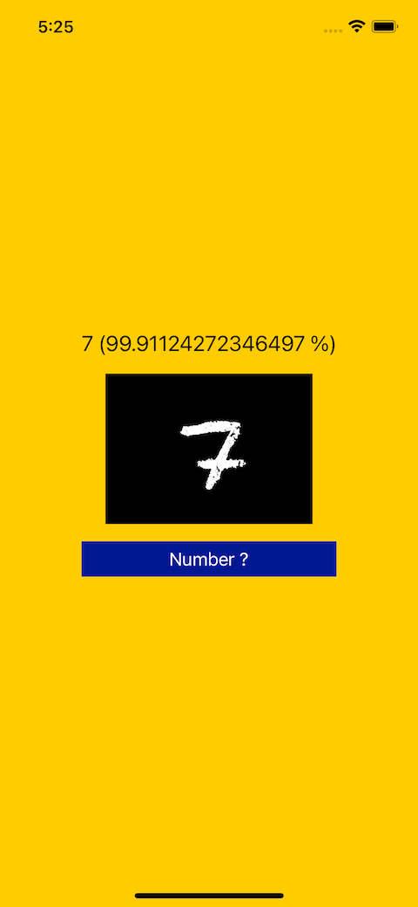

# WWMachineLearning+MNIST
[](https://developer.apple.com/swift/) [](https://developer.apple.com/swift/)  [](https://developer.apple.com/swift/) [](https://developer.apple.com/swift/)

### [Introduction - 簡介](https://swiftpackageindex.com/William-Weng)
- [Classify a single handwritten digit (supports digits 0-9).](https://www.youtube.com/watch?v=OCU7-5LdPhY)
- [將單一手寫數字分類（支援數字 0-9）。](https://www.youtube.com/watch?v=bte8Er0QhDg)



### [Installation with Swift Package Manager](https://medium.com/彼得潘的-swift-ios-app-開發問題解答集/使用-spm-安裝第三方套件-xcode-11-新功能-2c4ffcf85b4b)

```bash
dependencies: [
    .package(url: "https://github.com/William-Weng/WWMachineLearning_MNIST.git", .upToNextMajor(from: "1.0.0"))
]
```

### Function - 可用函式
|函式|功能|
|-|-|
|loadModel(progress:completion:)|載入模型 (從快取 or 網路重新下載)|
|loadModel()|載入模型 (從快取 or 網路重新下載)|
|classifyNumber(image:result:)|分析圖片是什麼物體|
|classifyNumber(image:)|分析圖片是什麼物體|
|classifyNumbers(image:standardValue:result:)|分析圖片哪一些物體們的機率|
|classifyNumbers(image:standardValue:)|分析圖片哪一些物體們的機率|

### Example
```swift
import UIKit
import WWMachineLearning_Resnet50
import WWMachineLearning_MNIST

final class ViewController: UIViewController {
    
    @IBOutlet weak var resultLabel: UILabel!
    @IBOutlet weak var numberImageView: UIImageView!
    
    override func viewDidLoad() {
        super.viewDidLoad()
        
        Task {
            let url = await WWMachineLearning.MNIST.shared.loadModel()
            print(url)
        }
    }
    
    @IBAction func probabilityTest(_ sender: UIButton) {
        
        Task {
            switch await WWMachineLearning.MNIST.shared.classifyNumber(image: numberImageView.image) {
            case .failure(let error): sender.setTitle(error.localizedDescription, for: .normal)
            case .success(let info): resultLabel.text = "\(info.label) (\(info.probability * 100.0) %)"
            }
        }
    }
}
```
